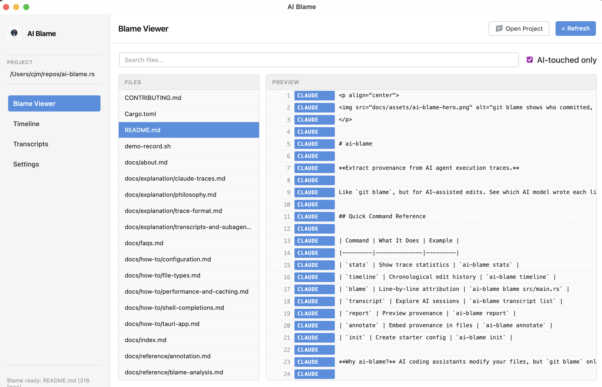

<p align="center">
  
</p>

# ai-blame

[](https://crates.io/crates/ai-blame)
[](https://pypi.org/project/ai-blame/)
[](https://ai4curation.github.io/ai-blame)
[](https://deepwiki.com/ai4curation/ai-blame)

**Extract provenance from AI agent execution traces.**

Like `git blame`, but for AI-assisted edits. See which AI model wrote each line of code.

## Quick Command Reference

| Command | What It Does | Example |
|---------|--------------|---------|
| `stats` | Show trace statistics | `ai-blame stats` |
| `timeline` | Chronological edit history | `ai-blame timeline` |
| `blame` | Line-by-line attribution | `ai-blame blame src/main.rs` |
| `transcript` | Explore AI sessions | `ai-blame transcript list` |
| `report` | Preview provenance | `ai-blame report` |
| `annotate` | Embed provenance in files | `ai-blame annotate` |
| `init` | Create starter config | `ai-blame init` |

**Why ai-blame?** AI coding assistants modify your files, but `git blame` only shows who *committed* the changes—not which AI model wrote them. ai-blame fills this gap.

## Installation

### Using Python Package Managers (Recommended)

The easiest way to install ai-blame is using Python package managers. No Rust toolchain required!

```bash
# Using uv (recommended)
uv add --dev ai-blame

# Using pip
pip install ai-blame

# Using pipx (for global installation)
pipx install ai-blame
```

This installs a pre-built binary that works exactly like the Rust version—fast, reliable, and dependency-free.

### Using Cargo (Rust)

```bash
# Install from crates.io
cargo install ai-blame

# Or install from source
git clone https://github.com/ai4curation/ai-blame
cd ai-blame
cargo install --path .
```

### From Pre-built Binaries

Download the latest release from the [releases page](https://github.com/ai4curation/ai-blame/releases).

## Quick Start

```bash
# Check what traces are available
ai-blame stats

# View timeline of all AI actions
ai-blame timeline

# Preview what would be added (stdout report)
ai-blame report --initial-and-recent

# Apply changes (writes annotations / sidecars)
ai-blame annotate --initial-and-recent

# Filter to specific files
ai-blame annotate --pattern ".py"
```

## Demo

Watch a complete walkthrough of all commands:

[](https://asciinema.org/a/765613)

Shows setup, discovery, line-level blame analysis, and annotation workflows using real traces from ai-blame development.

## Performance: Caching

The tool includes DuckDB caching enabled by default to speed up repeated runs. Trace files are parsed once and results are cached in `.ai-blame.ddb` in your trace directory.

**Caching enabled by default:**
```bash
# Cache is automatically used
ai-blame stats

# Rebuild cache (delete existing cache and re-parse)
ai-blame stats --rebuild-cache

# Disable cache for a specific run
ai-blame stats --no-cache
```

**Expected speedup:**
- First run: ~55 seconds (builds cache)
- Subsequent runs (unchanged traces): ~3-5 seconds (**90% faster** 🚀)
- Incremental updates: Proportional to changed files

**Cache behavior:**
- **Claude traces**: All-or-nothing invalidation (if any trace file changes, all are re-parsed due to cross-file UUID dependencies)
- **Codex traces**: Per-file invalidation (each session/file is independent)
- **Staleness detection**: Modified time + file size comparison

**Cache management:**
```bash
# Delete the cache file to reset
rm .ai-blame.ddb

# Or use the CLI flag to rebuild
ai-blame stats --rebuild-cache

# Disable caching globally
export AI_BLAME_NO_CACHE=1
```

## Desktop App

The Tauri-based desktop app provides a visual interface for exploring AI-assisted code edits.



**Features:**

- **Blame Viewer** — Browse files with line-by-line AI attribution and details panel
- **Timeline** — Chronological view of all AI edits with navigation to source files
- **Transcripts** — Search and explore AI conversation sessions with full message content
- **Settings** — Configure project paths and caching options

```bash
# Run the desktop app
cd src-tauri && cargo run --release
```

See the [Desktop App documentation](https://ai4curation.github.io/ai-blame/how-to/tauri-app/) for full details.

## Documentation

This repo uses **MkDocs (Material)** for user/CLI documentation.

```bash
python -m venv .venv
source .venv/bin/activate
pip install -r docs/requirements.txt
mkdocs serve
```

## Output Examples

### YAML/JSON files — Append directly

```yaml
# config.yaml
name: my-project
version: 1.0

edit_history:
  - timestamp: "2025-12-01T08:03:42+00:00"
    model: claude-opus-4-5-20251101
    agent_tool: claude-code
    action: CREATED
```

### Code files — Sidecar or comments

```python
# main.py (with comment policy)

def hello():
    print("Hello, world!")

# --- edit_history ---
# - timestamp: '2025-12-01T08:03:42+00:00'
#   model: claude-opus-4-5-20251101
#   action: CREATED
# --- end edit_history ---
```

Or use sidecar files: `main.py` → `main.history.yaml`

## Configuration

Create `.ai-blame.yaml` in your project root:

```yaml
defaults:
  policy: sidecar
  sidecar_pattern: "{stem}.history.yaml"

rules:
  - pattern: "*.yaml"
    policy: append
  - pattern: "*.json"
    policy: append
    format: json
  - pattern: "*.py"
    policy: comment
    comment_syntax: hash
  - pattern: "tests/**"
    policy: skip
```

## Supported Agents

| Agent | Status | Format |
|-------|--------|--------|
| Claude Code | ✅ Supported | Native `.jsonl` traces under `~/.claude/` |
| OpenAI Codex / GitHub Copilot | ✅ Supported | Native `.jsonl` traces (incl. CLI ghost snapshots) |
| Amp, Cursor, Goose, Cline, Kimi, … | ✅ Supported via [agent-trace.dev](https://agent-trace.dev/) | `.agent-trace/*.json` v1 sidecars (any producer) |
| Others | PRs welcome! | |

### agent-trace.dev v1

ai-blame reads the open, vendor-neutral
[agent-trace.dev v1 spec](https://agent-trace.dev/) from
`<repo>/.agent-trace/*.json` (and `~/.agent-trace/`). Any tool that
emits the spec — whether as a first-party feature or via a third-party
exporter that converts an agent's native logs — is automatically
supported.

> agent-trace.dev records carry attribution ranges + `content_hash`
> rather than raw `old_string` / `new_string` patches, so the `stats`,
> `timeline`, `report`, and `transcript` commands work fully against
> them; `blame` / `annotate` will mark touched lines with metadata but
> cannot perform the same patch-walk reconstruction as the native Claude
> / Codex parsers. See
> [`src/parsers/agent_trace.rs`](src/parsers/agent_trace.rs) for the
> mapping details.

## Differences from Python Version

This Rust port maintains CLI compatibility with the [Python version](https://github.com/ai4curation/ai-blame) but offers significant improvements:

- **Better performance** - 10-100x faster trace parsing and file processing
- **Static typing** - Compile-time guarantees for correctness
- **Single binary** - No runtime dependencies
- **Memory safety** - Rust's ownership system prevents common bugs
- **Easy Python installation** - Install via `pip` or `uv` with pre-built wheels

### For Python Users

You can still install ai-blame using Python package managers:

```bash
uv add --dev ai-blame
# or
pip install ai-blame
```

This installs the same high-performance Rust binary—no Rust toolchain needed! The CLI commands remain the same, so it's a drop-in replacement for the Python version.

> **Note**: The Python API from the original version is not available in this Rust port. The CLI provides all functionality. If you need programmatic access, please [open an issue](https://github.com/ai4curation/ai-blame/issues) describing your use case.

## Development

```bash
# Run tests
cargo test

# Run with debug output
RUST_LOG=debug cargo run -- report

# Build for release
cargo build --release

# Format code
cargo fmt

# Lint code
cargo clippy
```

## Repository Structure

This repository uses a Cargo workspace to organize the CLI and Tauri UI components:

```
ai-blame/
├── src/                 # Core library (ai-blame crate)
│   ├── lib.rs          # Library root
│   ├── main.rs         # CLI binary entry point
│   ├── cli.rs          # CLI command parsing (feature-gated)
│   ├── blame.rs        # Line-level blame computation
│   ├── config.rs       # Configuration loading
│   ├── extractor.rs    # Trace file parsing
│   ├── models.rs       # Data models
│   └── updater.rs      # File annotation logic
├── src-tauri/           # Tauri desktop app (ai-blame-ui crate)
│   ├── Cargo.toml      # UI-specific dependencies
│   ├── tauri.conf.json # Tauri configuration
│   ├── src/main.rs     # Tauri backend (invokes core library)
│   └── icons/          # Application icons for bundling
├── ui/                  # Static HTML/CSS/JS frontend
│   ├── index.html      # Main UI layout
│   ├── app.js          # UI logic
│   └── styles.css      # Styling
├── tests/               # Integration tests
├── Cargo.toml           # Workspace root + core library config
└── tools/               # Development utilities
    └── generate_icons.py
```

### Workspace Design

- **Core Library (`ai-blame`)**: Contains all reusable logic for parsing traces, computing blame, and updating files
- **CLI Binary**: Built with the `cli` feature flag (enabled by default)
- **Tauri UI (`ai-blame-ui`)**: Depends on the core library with `default-features = false` to avoid pulling in CLI-only dependencies like `clap`

This structure follows Tauri best practices by keeping the Tauri binary in `src-tauri` (required for `tauri dev/build` to work) while sharing code through the core library.

### Feature Flags

- `cli` (default): Enables CLI command parsing with clap. Disable with `--no-default-features` when using only the library API.

## License

BSD-3-Clause

## Contributing

Contributions welcome! This is a port of the [Python ai-blame](https://github.com/ai4curation/ai-blame) project.

PRs especially welcome for:
- Additional agent support (Cursor, Aider, Copilot, etc.)
- Performance improvements
- Bug fixes
- Documentation improvements
