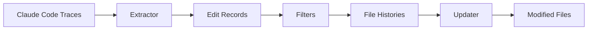

# How It Works

This document explains the internal workings of `ai-blame`.

## Overview



## Step 1: Locate Trace Files

Claude Code stores execution traces in:

```
~/.claude/projects/<encoded-cwd>/
```

Where `<encoded-cwd>` is a filesystem-safe encoding of the project path (path separators become `-`, and punctuation like `.` may also be normalized to `-`).

## Step 2: Parse Trace Files

Each trace file is JSONL: one JSON record per line. `ai-blame` looks for successful tool results that correspond to file writes/edits (e.g., records that include a `toolUseResult.filePath` and either a create indicator or patch information).

## Step 3: Extract Metadata

For each successful edit, we extract fields like timestamp, model, agent/tool version, whether it was a create vs edit, and (when available) patch details.

## Step 4: Apply Filters

Filters reduce the volume of edit records:

- File pattern filter
- Size filter (`--min-change-size`)
- First+last only (`--initial-and-recent`)

## Step 5: Convert to File Histories

Edit records are grouped by file and converted to file-level histories (`edit_history`).

## Step 6: Load Output Configuration

Rules in `.ai-blame.yaml` decide how each file type is handled (`append`, `sidecar`, `comment`, `skip`).

## Step 7: Apply Changes

Based on the output policy, `ai-blame` writes:

- **Append**: embeds `edit_history` into YAML/JSON files
- **Sidecar**: writes a companion `*.history.yaml`
- **Comment**: embeds a comment block at the end of code files


