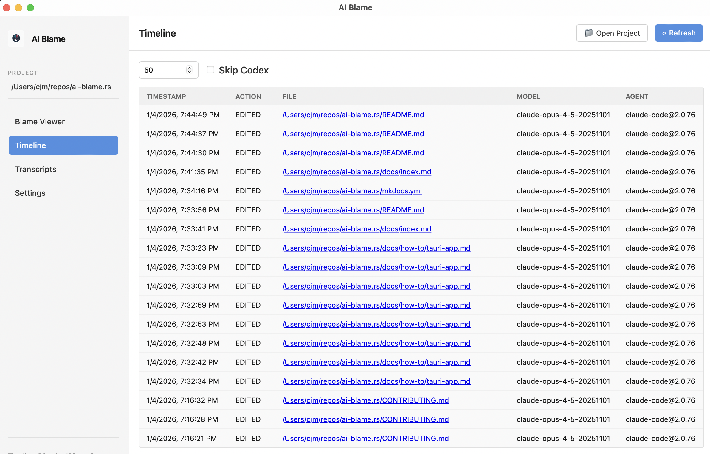
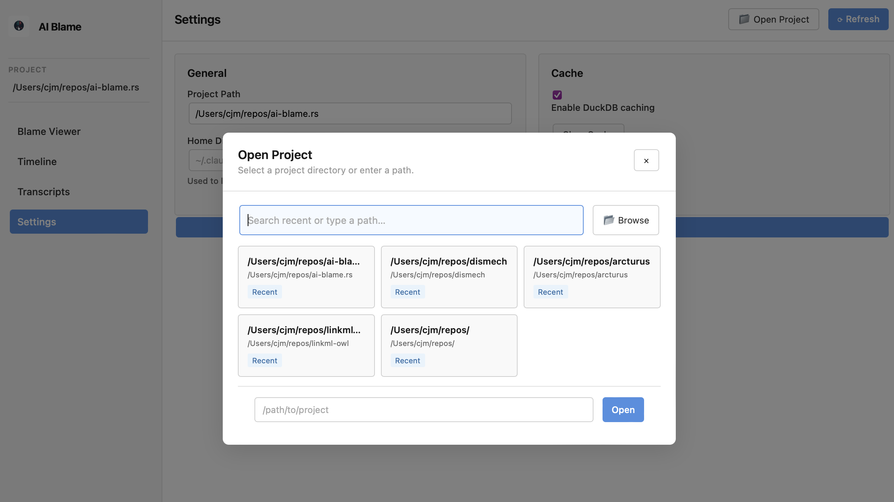

# Tauri Desktop App

## Overview

The AI Blame Tauri app provides a modern, cross-platform desktop interface for visualizing and exploring AI-assisted code edits. Built with Tauri, the app offers a fast, native experience with a responsive web-based UI that connects directly to the ai-blame Rust library.


The desktop app complements the CLI by providing visual exploration of AI-assisted edits with interactive navigation between views.

## Why Use the Desktop App?

The Tauri app complements the CLI by providing:

- **Visual blame viewer** — Inspect file-level attribution with edit history and session details
- **Timeline view** — Chronological list of all AI edits with direct navigation to files
- **Transcript search** — Search across all AI sessions to find specific conversations
- **Cross-view navigation** — Jump from timeline → blame → transcript and back
- **Configuration studio** — Edit `.ai-blame.yaml` visually with live preview (planned)
- **Real-time monitoring** — Watch for new traces (planned)

For comprehensive CLI functionality, see the [CLI documentation](../reference/cli.md).

## User Interface

The app features a modern, responsive interface with four main views accessible from the sidebar navigation. Each view is fully functional and connected to the backend.

### Blame Viewer

View file-level attribution showing which AI models edited specific lines of code.

**Features:**

- **Three-panel layout:**
    - Files panel (left): Browse project files with search and "AI-touched only" filter
    - Code panel (center): View file content with line numbers and attribution
    - Details panel (right): Show model, timestamp, and session info for selected lines
- **Interactive elements:**
    - Click a line to see who edited it, when, and via which session
    - Click the session ID in details to jump to the transcript
    - Clickable file names for quick selection
    - Search files by name pattern
- **Filtering:**
    - Toggle "AI-touched only" to see only files edited by AI
    - Search for specific files

**Planned improvements:**

- Syntax highlighting for all file types
- Color-coded lines by AI model
- Filter by model, date range, or file pattern
- Export to HTML

### Timeline



Chronological list of all AI edits in your project with direct navigation to source files.

**Features:**

- **Timeline table** with columns:
    - Timestamp (formatted local time)
    - Action (CREATED or EDITED)
    - File (clickable to jump to blame viewer)
    - Model (AI model used)
    - Agent (agent tool and version, e.g., claude-code@2.0)
- **Controls:**
    - Limit: Configure how many recent edits to show (default 50)
    - Skip Codex: Exclude GitHub Copilot/Codex traces
- **Navigation:**
    - Click any file name to jump to Blame Viewer with that file loaded
    - See agent version alongside agent name for context

**Planned improvements:**

- Filter by model, date range, or file pattern
- Heatmap showing peak editing times
- Aggregate statistics (most-edited files, most-active models)

### Transcripts


Search and explore AI conversation sessions with full message content.

**Features:**

- **Session list** (left side):
    - Browse all AI sessions discovered in your project
    - Shows session date, message count, and agent type
    - Clickable sessions to view full conversation
- **Search within transcript:**
    - Real-time search across message content (case-insensitive)
    - Filters messages as you type
    - Shows "no matches" when search returns empty
- **Transcript viewer** (right side):
    - Full conversation history with user and assistant messages
    - Message metadata: timestamp, model, token usage
    - Content blocks: text, thinking, code, tool use, commands
    - Formatted output for all content types
- **Navigation:**
    - Click session ID from Blame Details to jump here
    - Automatically loads the session transcript

**Planned improvements:**

- Cross-transcript search (find text across all sessions)
- Filter sessions by agent tool, model, date range
- Export transcripts to markdown or PDF
- Syntax highlighting for code blocks

### Settings



Configure AI Blame behavior and manage project settings.

**Features:**

- **General settings:**
    - Project path selection via file picker
    - Home directory override for trace discovery
    - Enable/disable DuckDB caching
- **Cache management:**
    - Clear cache button to reset cached trace data
    - Toggle caching on/off
- **Future options:**
    - Default policy (Sidecar, Append, Comment, Skip)
    - Configuration file editor

## Installation & Setup

### Prerequisites

To build or run the Tauri app, you need:

- [Rust toolchain](https://rustup.rs/) (latest stable)
- [Tauri prerequisites](https://tauri.app/v1/guides/getting-started/prerequisites/) for your platform:
    - **Linux:** `webkit2gtk`, `libgtk-3`, `libayatana-appindicator3`
    - **macOS:** Xcode Command Line Tools
    - **Windows:** Microsoft Visual Studio C++ Build Tools

Check your setup:

```bash
cargo tauri info  # Verify prerequisites are installed
```

### Running the App

#### Option 1: Desktop App (Recommended)

Build and run the Tauri desktop application:

```bash
# From repo root
cd src-tauri
cargo run --release
```

This launches the native desktop app with the UI loaded from the `../ui/` directory.

#### Option 2: Development Mode

For UI development with hot reload (requires Tauri CLI):

```bash
# Install Tauri CLI
cargo install tauri-cli

# Run in dev mode (from repo root)
cargo tauri dev
```

Changes to `ui/` files will automatically refresh the app.

#### Option 3: Static Web View (No Backend)

For quick UI prototyping without Tauri:

```bash
# From repo root, serve the static UI
python3 -m http.server -d ui 8000

# Visit http://localhost:8000 in your browser
```

**Note:** The browser version has no backend access, so Tauri-specific features (file picker, trace scanning) won't work.

### Building Release Binaries

To create distributable binaries for your platform:

```bash
# From repo root
cargo tauri build
```

This generates platform-specific installers in `src-tauri/target/release/bundle/`:

- **Windows:** `.msi` and `.exe` installers
- **macOS:** `.dmg` and `.app` bundle
- **Linux:** `.AppImage`, `.deb`, and `.rpm` packages

## Architecture

The Tauri app consists of two main parts:

### Frontend (UI)

Located in the `ui/` directory:

- **`index.html`** — Page structure and layout
- **`styles.css`** — Responsive design and theming
- **`app.js`** — Navigation logic and mock data

The frontend is a simple HTML/CSS/JavaScript application without external dependencies.

### Backend (Rust)

Located in `src-tauri/src/main.rs`, the Tauri backend calls the core `ai-blame` library with no code duplication.

**Current backend commands:**

- `app_info` — Application name and version
- `pick_project_dir` — File picker for project selection
- `list_project_files` — List files in project with filtering
- `list_agent_touched_files` — Get files edited by AI agents
- `blame_file` — Generate line-level attribution for a file
- `list_timeline` — Get chronological list of all edits with filtering
- `list_transcripts` — Discover all AI conversation sessions
- `get_transcript` — Load full transcript by session ID
- `search_transcripts` — Search transcripts by query, agent, model, date range

**Planned backend commands:**

- `load_config` — Load `.ai-blame.yaml` configuration
- `save_config` — Save configuration to file
- Advanced trace statistics and analytics

### Communication

The frontend and backend communicate via Tauri's IPC (Inter-Process Communication):

- **Commands:** Frontend calls Rust functions (async RPC)
- **Events:** Backend pushes updates to frontend (pub/sub)

## Known Limitations

- **No file operations** — Cannot read or write files from the UI (CLI recommended for annotate)
- **Limited state persistence** — Selected project is remembered, but other settings reset on restart
- **No syntax highlighting** — Code blocks display as plain text
- **No color-coding** — Lines not yet color-coded by AI model
- **Search limitations** — In-transcript search is JavaScript-based (frontend-only); cross-transcript search available via backend but not yet exposed in UI
- **No keyboard shortcuts** — Navigation is primarily mouse/click-based

## Development Roadmap

### Planned Enhancements

**Search & Discovery:**

- Expose cross-transcript search in UI
- Add filters: by model, agent, date range
- Session search by metadata

**Blame Viewer:**

- Syntax highlighting for code files
- Color-code lines by AI model
- Edit history timeline for selected lines
- Export blame view to HTML or markdown

**Configuration UI:**

- Load and validate `.ai-blame.yaml` files
- Visual rule builder
- Real-time configuration preview

**Polish & Advanced Features:**

- Persistent state (selected project, view preferences)
- Dark mode support with persistence
- Real-time file system watching
- Advanced analytics: heatmaps, statistics
- Keyboard shortcuts and accessibility

## Troubleshooting

### "No traces found" or Timeline/Transcripts are empty

This can happen if:
1. **Project not set** — Click "📁 Open Project" in the header and select your project directory
2. **No traces discovered** — Check that your project has Claude Code traces in `~/.claude/projects/`
3. **Home directory path** — If traces are in a custom location, set it in Settings → Home Directory

For debugging, use the CLI:
```bash
ai-blame stats  # Check what traces were found
ai-blame timeline  # See all timeline events
```

### Tauri app won't build

Ensure you have all Tauri prerequisites installed:

```bash
cargo tauri info  # Check your setup
```

Common issues:

- **Linux:** Missing webkit2gtk or GTK development libraries
- **macOS:** Xcode Command Line Tools not installed
- **Windows:** Missing Visual Studio C++ Build Tools

See the [Tauri prerequisites guide](https://tauri.app/v1/guides/getting-started/prerequisites/) for platform-specific instructions.

### UI looks broken

Try clearing the cache or rebuilding:

```bash
cd src-tauri
cargo clean
cargo build --release
```

### "Blocked by CSP" errors in console

The Content Security Policy in `tauri.conf.json` restricts resource loading for security. This is normal — the app is designed to work within these constraints.

## Contributing to the UI

We welcome contributions! Here are ways you can help:

1. **UI/UX improvements** — Suggest layout changes or new features
2. **Frontend development** — Improve HTML/CSS/JS in `ui/`
3. **Backend commands** — Implement Tauri commands in `src-tauri/src/main.rs`
4. **Testing** — Test the UI and report issues
5. **Documentation** — Improve this guide or add tutorials

See [CONTRIBUTING.md](https://github.com/ai4curation/ai-blame/blob/main/CONTRIBUTING.md) for development setup and guidelines.

## CLI vs. Desktop App

Both the **CLI and desktop app** are now functional for exploring AI-assisted edits:

**Use the Desktop App for:**
- Visual blame exploration with details panel
- Timeline view of all edits
- Searching and exploring transcripts
- Cross-view navigation (jump between timeline, blame, and transcripts)
- Interactive exploration of AI sessions

**Use the CLI for:**
- Bulk operations and automation
- Annotating files with provenance data
- Advanced filtering and reporting
- Scripting and integration with other tools
- Production workflows

Example CLI commands:
```bash
ai-blame stats              # See available traces
ai-blame blame src/main.rs  # Show line-level blame
ai-blame timeline           # Chronological timeline
ai-blame report             # Generate a provenance report
ai-blame annotate           # Embed provenance in files
```

## See Also

- [UI Prototype TODO](https://github.com/ai4curation/ai-blame/blob/main/ui/TODO.md) — Detailed implementation roadmap
- [UI Implementation Plan](https://github.com/ai4curation/ai-blame/blob/main/PLAN-UI.md) — Full architecture and design doc
- [Tauri Documentation](https://tauri.app/v1/guides/) — Tauri framework documentation
- [CLI Reference](../reference/cli.md) — Full CLI command documentation
- [Configuration Guide](./configuration.md) — How to configure AI Blame behavior
