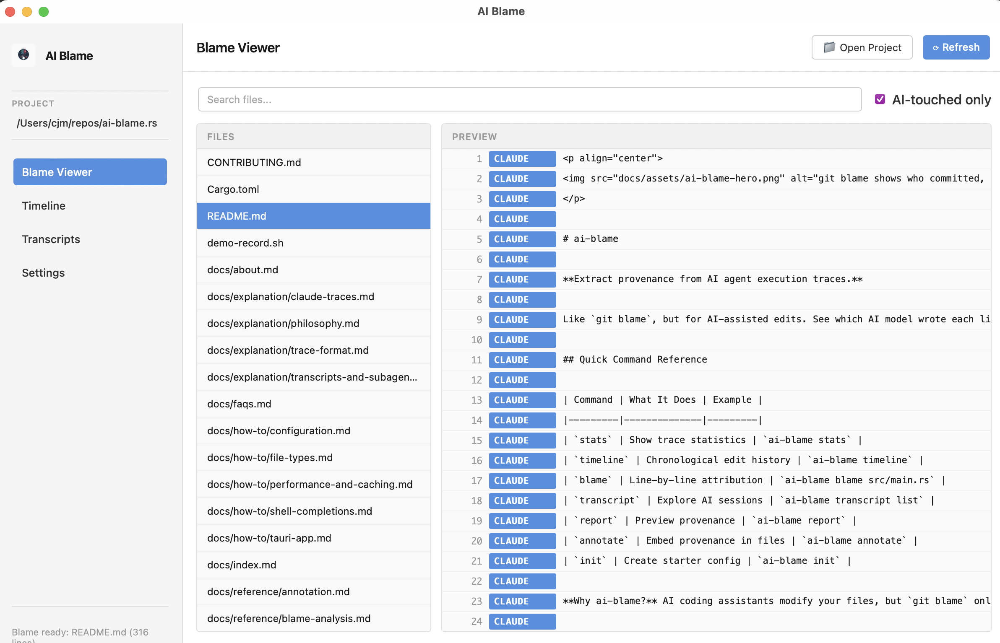

<p align="center">
  
</p>

# ai-blame

**Extract provenance from AI agent execution traces.**

Like `git blame`, but for AI-assisted edits. See which AI model wrote each line of code.

---

## Quick Command Reference

| Command | What It Does | When to Use |
|---------|--------------|-------------|
| `init` | Create starter config | First-time setup |
| `stats` | Show trace statistics | Discover available traces |
| `timeline` | Chronological edit timeline | Understand project history |
| `transcript` | Explore AI sessions | Review agent conversations |
| `blame` | Line-by-line attribution | See who edited what |
| `report` | Preview provenance | Dry-run before annotating |
| `annotate` | Embed provenance | Apply changes to files |

**→** [Full Command Index](reference/index.md) | **→** [Quickstart](tutorials/quickstart.md)

---

## Demo

Watch a complete walkthrough of all commands in action:

[](https://asciinema.org/a/765613)

The demo shows setup, discovery (stats, timeline, transcripts), line-level blame analysis (the centerpiece), and annotation workflows using real traces from ai-blame development (80 traces, 378 edits).

---

## What is ai-blame?

As AI agents increasingly assist with knowledge base curation, documentation, and code generation, we need to track **provenance** — which agent/model made what changes, when, and why.

`ai-blame` parses execution traces from AI coding assistants (Claude Code, GitHub Copilot, and others) and extracts a structured audit trail of file modifications. This history can be:

- **Appended** directly to YAML/JSON files as a `edit_history` section
- **Written** to sidecar files (e.g., `foo.history.yaml`)
- **Embedded** as comments in code files

## Typical Workflows

### 📊 Exploration Workflow

**Commands:** `stats` → `timeline` → `transcript list` → `transcript view`

Start by discovering what traces and edits are available:

#### 1. Overview of Traces and Edits

```bash
$ ai-blame stats
```

```
Trace directory: /Users/alice/.claude/projects/-Users-alice-myproject/
Trace files: 5
  Session traces: 3
  Agent traces: 2

Files with edits (all files): 23
Total successful edits: 47
```

#### 2. See Timeline of All Actions

```bash
$ ai-blame timeline
```

```
=== Timeline of Actions ===
2025-12-01 08:03:42 UTC  [CREATED]  disease_definitions.yaml (claude-opus-4-5)
2025-12-01 08:05:18 UTC  [EDITED]   disease_definitions.yaml (claude-opus-4-5)
2025-12-02 14:12:15 UTC  [CREATED]  phenotypes.yaml (gpt-4)
...
```

#### 3. List and Review Sessions

```bash
$ ai-blame transcript list --columns SATMO
```

Shows all Claude Code and Codex sessions with models used in each:

```
Session ID                               Agent           Start Time             Msgs     Models
─────────────────────────────────────────────────────────────────────────────────────────────────────────────────────
483c7d95-6b9c-46db-afd4-3ecb6257781a    claude-code     2025-12-01 03:56         53      claude-opus-4-5
483c7d95-6b9c-46db-afd4-3ecb6257781a    claude-code     2025-12-01 03:55          2      claude-haiku
```

See [Understanding Session ID Duplication](explanation/transcripts-and-subagents.md) to learn why the same Session ID appears multiple times (subagent sessions).

#### 4. Explore a Specific Session

```bash
$ ai-blame transcript view 483c7d95 --full --show-thinking
```

Shows the complete session transcript with all messages, reasoning, and tool use.

### 💾 Annotation Workflow

**Commands:** `report` → `annotate` (with `--dry-run` preview pattern)

Extract and embed provenance into your project files:

#### 1. Show Line-by-Line Attribution

```bash
$ ai-blame blame src/main.rs
```

```
     1  claude-opus-4-5    fn process_data(input: &str) -> Result<Vec<Item>> {
     2  claude-opus-4-5    let items = parse_input(input)?;
     3  claude-opus-4-5
     4  claude-opus-4-5    items.iter()
     5  claude-opus-4-5        .filter(|item| item.is_valid())
     6  claude-3-5-sonnet   .map(|item| transform(item))
     7  claude-3-5-sonnet   .collect()
     8  claude-opus-4-5    }
```

Use `--blocks` to group consecutive lines from the same model:

```bash
$ ai-blame blame src/main.rs --blocks
```

#### 2. Preview Provenance Report

```bash
$ ai-blame report --initial-and-recent
```

Shows what `edit_history` would be added to each file:

```
Processing: disease_definitions.yaml

Edits for disease_definitions.yaml:
  [CREATED] 2025-12-01 08:03:42 UTC
    Model: claude-opus-4-5-20251101
    Agent: claude-code (v2.0.75)

  [EDITED] 2025-12-15 20:34:29 UTC
    Model: claude-opus-4-5-20251101
    Agent: claude-code (v2.1.0)
```

#### 3. Embed Provenance in Your Files

```bash
$ ai-blame annotate --initial-and-recent --dry-run
```

Preview the changes, then apply with:

```bash
$ ai-blame annotate --initial-and-recent  # Writes to files
```

## Key Features

- **Line-level blame** — `ai-blame blame` shows git-blame-style attribution for each line in a file
- **Desktop UI** — Visual blame viewer, timeline, and transcript explorer
- **Automatic trace discovery** — Finds execution traces from multiple AI agents
- **Configurable output policies** — Append, sidecar, or comment-based history
- **Flexible filtering** — By file pattern, change size, or time range
- **Dry-run by default** — Preview changes before applying
- **Multiple file type support** — YAML, JSON, Python, and more

---

## Desktop App

For visual exploration, the desktop app provides an interactive interface for browsing AI-assisted edits.



**Features:**

- **Blame Viewer** — Browse files with line-by-line AI attribution
- **Timeline** — Chronological view of all AI edits with navigation
- **Transcripts** — Search and explore AI conversation sessions
- **Settings** — Configure project paths and caching options

```bash
# Run the desktop app
cd src-tauri && cargo run --release
```

**→** [Desktop App Documentation](how-to/tauri-app.md)

## Supported Trace Sources

| Agent | Status |
|-------|--------|
| Claude Code | ✅ Supported |
| OpenAI Codex / GitHub Copilot | ✅ Supported |
| Others (Cursor, Aider, etc.) | PRs welcome! |

## Installation

```bash
git clone https://github.com/ai4curation/ai-blame
cd ai-blame

# Build with cargo
cargo build --release

# Optionally install it
cargo install --path .
```

## Documentation & Learning Paths

### 🚀 New to ai-blame?

Start here:

| | |
|---|---|
| **[Quickstart](tutorials/quickstart.md)** | 5-minute guide with the most common commands. Perfect for busy people! |
| **[Getting Started](tutorials/getting-started.md)** | Comprehensive hands-on tutorial: install, scan traces, annotate files. |
| **[Command Index](reference/index.md)** | Visual overview of all 7 commands with task-to-command mapping. |

### 📚 Learning by Task

Find what you need:

| Task | Documentation |
|------|---------------|
| **Understand sessions & subagents** | [Transcripts & Subagents](explanation/transcripts-and-subagents.md) |
| **Explore traces** | [Trace Exploration](reference/exploration.md) (stats, timeline, transcript) |
| **Annotate files with provenance** | [Provenance Annotation](reference/annotation.md) (report, annotate) |
| **Set up configuration** | [Setup & Configuration](reference/setup.md) (init command) |
| **Analyze line changes** | [Line-Level Analysis](reference/blame-analysis.md) (blame command) |
| **Optimize performance** | [Performance](reference/performance.md) (caching, filters) |
| **Configure output formats** | [Configuration Guide](how-to/configuration.md) |
| **Handle different file types** | [File Types](how-to/file-types.md) |
| **Customize display columns** | [Column Layouts](how-to/column-layouts.md) |

### 🔍 Understanding the System

Deep technical details:

| | |
|---|---|
| **[How It Works](explanation/how-it-works.md)** | Architecture overview: trace parsing, edit extraction, and blame computation. |
| **[Trace Format](explanation/trace-format.md)** | How execution traces are structured and parsed. |
| **[Claude Traces](explanation/claude-traces.md)** | Technical details on Claude Code trace format. |
| **[Codex Traces](explanation/codex-traces.md)** | Technical details on GitHub Copilot/Codex trace format. |
| **[Philosophy](explanation/philosophy.md)** | Why provenance tracking matters for AI-assisted curation. |
| **[CLI Syntax Reference](reference/cli.md)** | Complete command syntax and options reference. |

### 💬 FAQs & Community

| | |
|---|---|
| **[FAQs](faqs.md)** | Answers to common questions about installation, usage, and troubleshooting. |
| **[Contributing](https://github.com/ai4curation/ai-blame/blob/main/CONTRIBUTING.md)** | Want to help? See how to contribute code, documentation, and test cases. |


